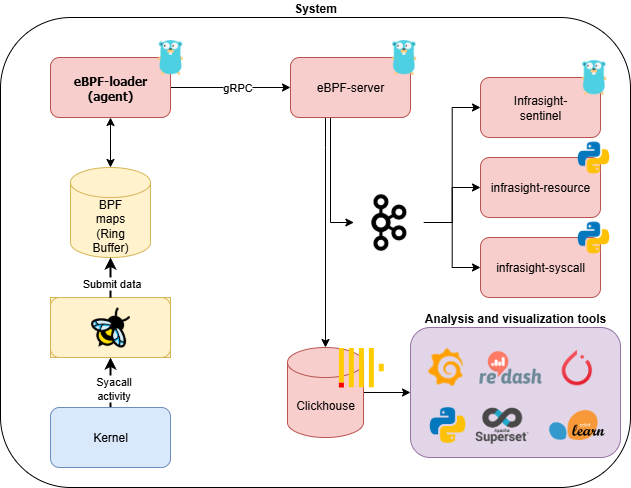

# InfraSight

**InfraSight** is an observability and auditing platform that uses eBPF to capture low-level system events (like `execve`, `open`, `connect`, etc.) and stream them to a ClickHouse backend for high-performance analysis.

It helps platform engineers, SREs, and security teams gain deep visibility into workloads, processes, and container behavior — on Linux and Kubernetes alike.

## 🚀 Key Features

- Fine-grained tracing of Linux syscalls using eBPF
- Real-time gRPC-based event delivery
- ClickHouse storage for fast analytics
- Kubernetes-native agent deployment
- CRD-based configuration (via `EbpfDaemonSet`)
- Extensible probe system

👉 **Get started [here](getting-started.md)** or jump to:

- [eBPF Programs](ebpf-programs.md)
- [ClickHouse Schema](database-schema.md)
- [Architecture Overview](architecture.md)
- [Live Demo](demo.md)